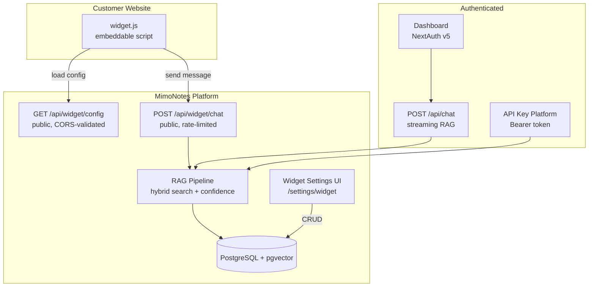

# MimoNotes → Embeddable Chatbot Platform: Architecture Audit

**Date:** 2026-06-15
**Status:** AUDIT COMPLETE — No code changes made
**Verdict:** 70% ready. Core widget infrastructure exists but needs hardening for SME self-serve.

---

## Executive Summary

MimoNotes already has a **fully functional chatbot widget system** — database models, public API endpoints, embeddable vanilla JS script, admin UI, and tests. The pivot from "AI Knowledge Workspace" to "Embeddable Chatbot Platform for SMEs" is primarily a **product positioning and feature completion** exercise, not a ground-up rebuild.

### What Exists (Strong Foundation)

| Component | Status | Location |
|-----------|--------|----------|
| Widget DB models | ✅ Complete | `Widget`, `WidgetConversation`, `WidgetMessage` in Prisma schema |
| Public widget config API | ✅ Live | `GET /api/widget/config?publicKey=xxx` |
| Public widget chat API | ✅ Live | `POST /api/widget/chat` (non-streaming) |
| Embeddable JS script | ✅ Complete | `public/widget.js` (275 lines, vanilla JS, XSS-safe) |
| Widget admin UI | ✅ Complete | `components/widget/widget-settings-form.tsx` |
| Widget CRUD lib | ✅ Complete | `lib/widget.ts` (create, list, update, delete, rotate keys) |
| Theme customization | ✅ Complete | Colors, logo, avatar, welcome message, position, quick replies |
| Domain whitelisting | ✅ Complete | `allowedDomains[]` with wildcard support |
| CORS security | ✅ Hardened | Origin validation, never returns `*` |
| Rate limiting | ✅ Dual-layer | 60/min per public key + 30/min per IP |
| Widget tests | ✅ 177 lines | `tests/lib/widget.test.ts` |
| Demo page | ✅ Ready | `widget-test.html` |
| API key platform | ✅ Complete | `mk_live_*` keys, SHA-256 hashed, usage tracking |
| RAG pipeline | ✅ Mature | Hybrid search (vector + BM25 + RRF), confidence-based refusal |
| Workspace isolation | ✅ RLS | PostgreSQL Row Level Security with workspace context |
| Billing/Stripe | ✅ Complete | Plans, subscriptions, webhooks, usage tracking |
| Entitlements | ✅ Complete | Feature gating per plan (public_widget, custom_branding, etc.) |

### What's Missing (Gaps to Close)

| Gap | Severity | Effort | Phase |
|-----|----------|--------|-------|
| Widget chat is non-streaming | HIGH | 2-3 days | P1 |
| No embeddable JS SDK (production-grade) | HIGH | 3-5 days | P1 |
| No lead capture (name, email, WhatsApp) | HIGH | 2-3 days | P2 |
| `/api/v1/chat` is placeholder (not wired to RAG) | MEDIUM | 1 day | P1 |
| No conversation history retrieval for visitors | MEDIUM | 1 day | P1 |
| No widget webhook/callback for events | LOW | 1-2 days | P3 |
| Rate limiting uses in-memory Map (won't scale) | LOW | 1 day | P3 |
| No WhatsApp integration | HIGH | 2-3 weeks | P3 |

---

## Current Architecture



### Widget Request Flow

```
1. Customer adds <script src="https://mimotes.ekohomelab.online/widget.js" data-key="pw_pub_xxx">
2. widget.js loads → fetches GET /api/widget/config?publicKey=pw_pub_xxx
3. Config returns: theme, welcomeMessage, quickReplies, allowedDomains
4. widget.js validates origin against allowedDomains (client-side)
5. User types message → POST /api/widget/chat { publicKey, message, visitorId, conversationId? }
6. Server validates: publicKey → origin check → rate limit → RAG query → response
7. Response: { conversationId, message, sources?, latencyMs }
```

### Database Models (Widget-Specific)

```prisma
model Widget {
  id              String   @id @default(uuid())
  workspaceId     String   @map("workspace_id")
  name            String   @db.VarChar(200)
  slug            String   @unique @db.VarChar(100)
  publicKey       String   @unique @map("public_key") @db.VarChar(50)
  secretKey       String   @unique @map("secret_key") @db.VarChar(100)
  allowedDomains  String[] @map("allowed_domains")
  isActive        Boolean  @default(true) @map("is_active")
  // Theme
  primaryColor    String   @default("#3B82F6") @map("primary_color")
  backgroundColor String   @default("#FFFFFF") @map("background_color")
  textColor       String   @default("#1F2937") @map("text_color")
  logoUrl         String?  @map("logo_url")
  avatarUrl       String?  @map("avatar_url")
  welcomeMessage  String   @default("Hi! How can I help you?") @map("welcome_message")
  position        String   @default("bottom-right") @db.VarChar(20)
  quickReplies    String[] @default([]) @map("quick_replies")
}

model WidgetConversation {
  id          String   @id @default(uuid())
  widgetId    String   @map("widget_id")
  workspaceId String   @map("workspace_id")
  visitorId   String   @map("visitor_id")
  ipAddress   String?  @map("ip_address")
  userAgent   String?  @map("user_agent")
  status      String   @default("active")
  startedAt   DateTime @default(now()) @map("started_at")
  endedAt     DateTime? @map("ended_at")
}

model WidgetMessage {
  id             String   @id @default(uuid())
  conversationId String   @map("conversation_id")
  workspaceId    String   @map("workspace_id")
  role           String   @db.VarChar(20)
  content        String   @db.Text
  tokensUsed     Int?     @map("tokens_used")
  createdAt      DateTime @default(now()) @map("created_at")
}
```

### Entitlements (Plan Gating)

| Feature | Free | Pro | Enterprise |
|---------|------|-----|------------|
| `public_widget` | ❌ | ✅ | ✅ |
| `custom_branding` | ❌ | ✅ | ✅ |
| `api_access` | ❌ | ✅ | ✅ |
| Widget conversations | — | 5,000/mo | Unlimited |
| Custom domains | ❌ | ❌ | ✅ |

---

## Gap Analysis

### GAP-1: Widget Chat is Non-Streaming (HIGH)

**Current:** `POST /api/widget/chat` uses `generateRAGResponse()` — blocks until full response.
**Authenticated chat:** Uses `streamRAGResponse()` with SSE streaming.
**Impact:** Widget users wait 3-8 seconds staring at a loading spinner. Bad UX for customer-facing chatbots.
**Fix:** Wire widget chat to `streamRAGResponse()`, return SSE stream. Update `widget.js` to consume SSE.

### GAP-2: No Production-Grade JS SDK (HIGH)

**Current:** `public/widget.js` is 275 lines of vanilla JS. Works but:
- No versioning (CDN cache busting needed)
- No npm package for React/Vue integration
- No TypeScript types
- No event hooks (onMessage, onOpen, onClose)
- No accessibility (ARIA labels, keyboard nav)
**Fix:** Create `@mimonotes/widget` npm package + CDN-hosted versioned builds.

### GAP-3: No Lead Capture (HIGH)

**Current:** `WidgetConversation` tracks `visitorId` (anonymous UUID). No name/email/WhatsApp.
**Fix:** Add lead capture fields to `WidgetConversation`, create pre-chat form, add lead management dashboard.

### GAP-4: `/api/v1/chat` is Placeholder (MEDIUM)

**Current:** Returns `[API] Received: ${message}` — doesn't call RAG.
**Fix:** Wire to `streamRAGResponse()` with API key auth. Same as widget but for direct API consumers.

### GAP-5: No Conversation History for Visitors (MEDIUM)

**Current:** `WidgetConversation` and `WidgetMessage` exist but no GET endpoint to retrieve history.
**Fix:** Add `GET /api/widget/conversations?visitorId=xxx` endpoint.

---

## Recommended Architecture Changes

### Phase 1: Widget V1 Hardening

1. **SSE streaming for widget chat** — modify `POST /api/widget/chat` to support streaming
2. **Lead capture pre-chat form** — add name/email/WhatsApp fields to widget
3. **Conversation history endpoint** — `GET /api/widget/conversations`
4. **Wire `/api/v1/chat` to RAG** — connect placeholder to actual pipeline
5. **Widget JS SDK v2** — versioned, accessible, event hooks

### Phase 2: Lead Management

1. **Lead dashboard** — new tab in widget settings showing captured leads
2. **Lead export** — CSV/JSON export of leads
3. **Lead webhook** — POST to customer URL on new lead

### Phase 3: WhatsApp Integration

1. **WhatsApp Business API connector** — receive/send messages
2. **Widget ↔ WhatsApp bridge** — same RAG pipeline, different channel
3. **WhatsApp conversation sync** — store in `WidgetConversation`

---

## Risk Assessment

| Risk | Likelihood | Impact | Mitigation |
|------|-----------|--------|------------|
| Widget abuse (spam, DDoS) | HIGH | MEDIUM | Dual-layer rate limiting already exists. Add CAPTCHA for suspicious patterns. |
| Data leakage between tenants | LOW | CRITICAL | RLS + workspace isolation already strong. Widget queries workspace-scoped. |
| RAG hallucination in customer-facing chat | MEDIUM | HIGH | Confidence-based refusal already exists. Add "I don't know" fallback. |
| Cost explosion (free tier abuse) | MEDIUM | MEDIUM | Plan-based limits exist. Add per-widget conversation limits. |

---

## Files Audited

- `prisma/schema.prisma` — Widget, WidgetConversation, WidgetMessage models
- `app/api/widget/config/route.ts` — Public config endpoint
- `app/api/widget/chat/route.ts` — Public chat endpoint (non-streaming)
- `app/api/widget/analytics/route.ts` — Widget analytics
- `app/api/widgets/create/route.ts` — Widget CRUD (authenticated)
- `public/widget.js` — Embeddable vanilla JS script
- `components/widget/widget-settings-form.tsx` — Admin UI
- `lib/widget.ts` — Widget CRUD + CORS + validation
- `lib/entitlements.ts` — Feature gating
- `lib/rag/chain.ts` — RAG pipeline (streaming + non-streaming)
- `lib/middleware/tenant.ts` — Workspace isolation
- `lib/api-keys.ts` — API key management
- `tests/lib/widget.test.ts` — Widget tests
- `widget-test.html` — Demo page
