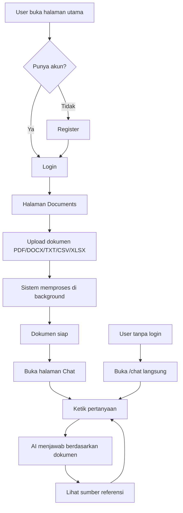
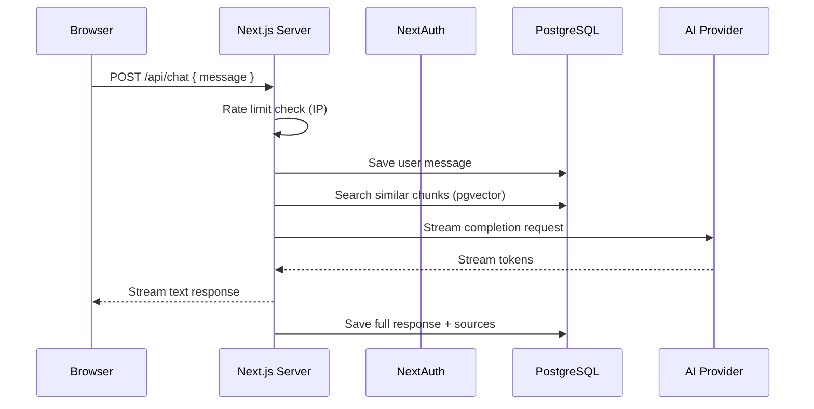
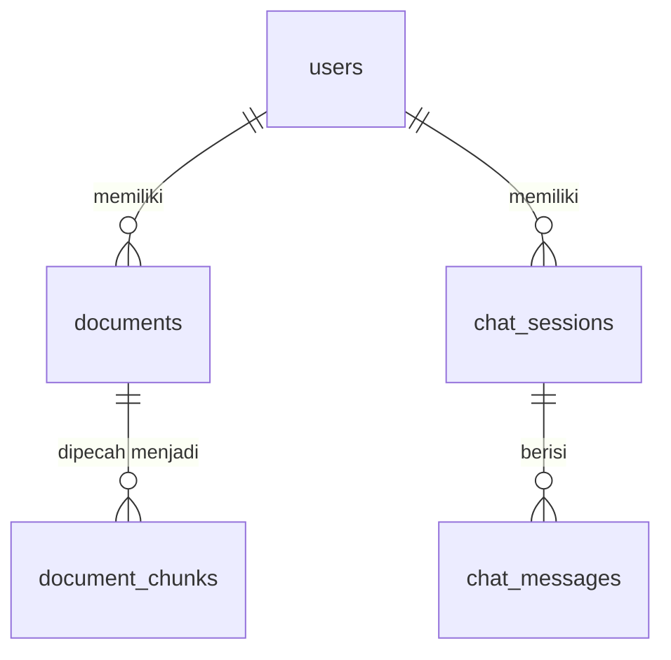
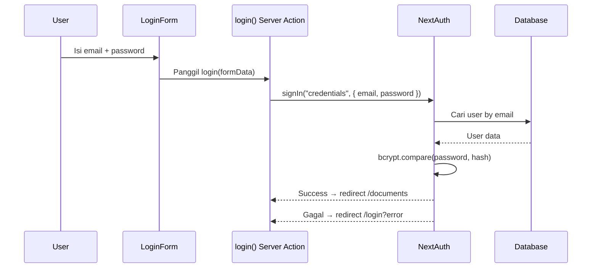
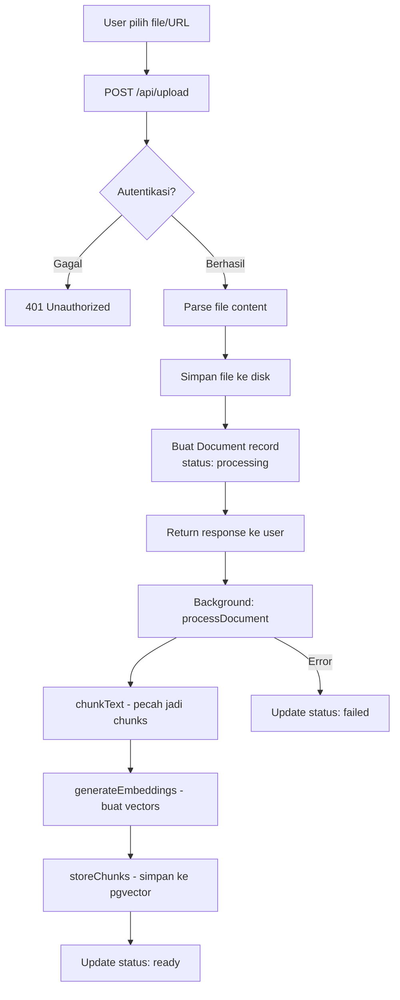
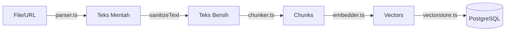
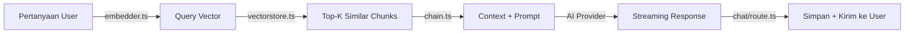
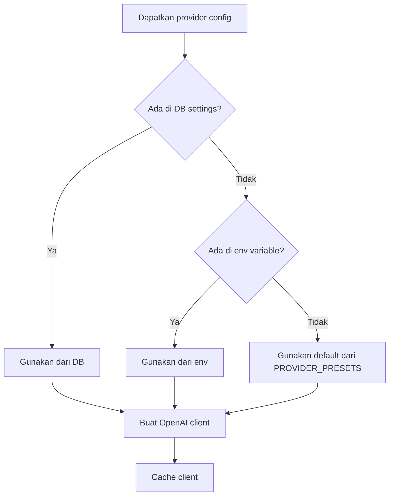
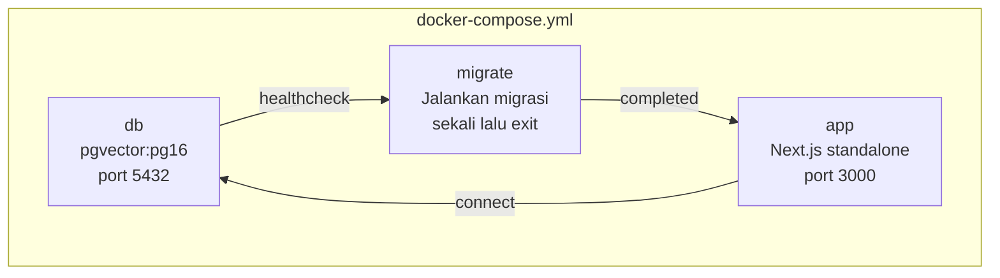

# 📖 Panduan Pengembang Mimotes

> Panduan ini ditulis untuk developer (termasuk junior) yang baru pertama kali melihat proyek ini. Semua penjelasan menggunakan Bahasa Indonesia dengan contoh kode yang relevan.

---

## Daftar Isi

1. [Aplikasi Ini Apa Sih?](#1-aplikasi-ini-apa-sih)
2. [Teknologi yang Digunakan](#2-teknologi-yang-digunakan)
3. [Struktur Proyek](#3-struktur-proyek)
4. [Cara Kerja Backend](#4-cara-kerja-backend)
5. [Cara Kerja Frontend](#5-cara-kerja-frontend)
6. [Database & Schema](#6-database--schema)
7. [Sistem Autentikasi](#7-sistem-autentikasi)
8. [API Endpoints](#8-api-endpoints)
9. [Pipeline RAG (Retrieval-Augmented Generation)](#9-pipeline-rag)
10. [Multi-AI Provider](#10-multi-ai-provider)
11. [Setup Lokal](#11-setup-lokal)
12. [Deploy dengan Docker](#12-deploy-dengan-docker)
13. [Masalah Umum & Solusi](#13-masalah-umum--solusi)
14. [File-file Penting](#14-file-file-penting)
15. [Cara Menambah Fitur Baru](#15-cara-menambah-fitur-baru)
16. [Debugging Guide](#16-debugging-guide)
17. [Roadmap Belajar](#17-roadmap-belajar)

---

## 1. Aplikasi Ini Apa Sih?

Mimotes adalah **chatbot AI berbasis pengetahuan**. Begini cara kerjanya dalam bahasa sederhana:

1. **Admin** mengupload dokumen (PDF, Word, Excel, teks, CSV, atau URL website)
2. Sistem **membaca isi dokumen**, memecahnya jadi potongan-potongan kecil (chunks), lalu mengubah setiap potongan menjadi angka-angka (embedding/vector)
3. **User** bertanya lewat chat
4. Sistem mencari potongan dokumen yang **paling relevan** dengan pertanyaan
5. Sistem mengirim potongan relevan + pertanyaan ke **AI** untuk menghasilkan jawaban
6. Jawaban dikirim ke user secara **streaming** (kata per kata, seperti mengetik)

Ini disebut **RAG** (Retrieval-Augmented Generation) — AI menjawab berdasarkan dokumen yang kita berikan, bukan hanya dari pengetahuan umumnya.

### User Journey



---

## 2. Teknologi yang Digunakan

| Teknologi | Untuk Apa | Versi |
|-----------|-----------|-------|
| **Next.js** | Framework web (frontend + backend) | 16.2.7 |
| **React** | UI library | 19 |
| **TypeScript** | Bahasa pemrograman (JavaScript + tipe data) | 5 |
| **Tailwind CSS** | Styling (utility-first CSS) | 4 |
| **PostgreSQL** | Database utama | 16 |
| **pgvector** | Extension untuk cari kemiripan vector | - |
| **Prisma** | ORM (koneksi ke database) | 6 |
| **NextAuth v5** | Autentikasi (login/register) | beta |
| **OpenAI SDK** | Koneksi ke AI provider | 5 |
| **Vercel AI SDK** | Streaming response | 5 |
| **bcryptjs** | Hash password | - |
| **pdf-parse** | Baca file PDF | 1.1.1 |
| **mammoth** | Baca file DOCX | - |
| **xlsx** | Baca file Excel | - |
| **cheerio** | Scrape website (HTML parser) | - |
| **csv-parse** | Baca file CSV | - |

### Kenapa Pakai Teknologi Ini?

- **Next.js App Router**: Memberikan kita file-based routing, server components, dan API routes dalam satu framework
- **Prisma**: Memudahkan query database tanpa menulis SQL manual (kecuali untuk vector operations)
- **pgvector**: Memungkinkan kita menyimpan dan mencari vector embeddings di PostgreSQL
- **NextAuth**: Solusi autentikasi yang sudah terintegrasi dengan Next.js
- **OpenAI SDK**: Semua AI provider modern mendukung format API yang sama (OpenAI-compatible)

---

## 3. Struktur Proyek

Mari kita lihat struktur folder dan apa isi masing-masing:

```
mimotes/
│
├── app/                        ← Semua halaman dan API (App Router)
│   ├── layout.tsx              ← Layout utama (wrap semua halaman)
│   ├── page.tsx                ← Halaman utama (/)
│   ├── globals.css             ← Global CSS (Tailwind)
│   │
│   ├── (auth)/                 ← Grup halaman autentikasi
│   │   ├── login/page.tsx      ← Halaman login (/login)
│   │   └── register/page.tsx   ← Halaman register (/register)
│   │
│   ├── (admin)/                ← Grup halaman admin
│   │   ├── documents/
│   │   │   ├── page.tsx        ← Daftar dokumen (/documents)
│   │   │   └── upload/page.tsx ← Upload dokumen (/documents/upload)
│   │   └── settings/page.tsx   ← Pengaturan AI (/settings)
│   │
│   ├── chat/page.tsx           ← Halaman chat (/chat)
│   │
│   └── api/                    ← Backend API endpoints
│       ├── auth/
│       │   ├── [...nextauth]/route.ts  ← NextAuth handler
│       │   └── register/route.ts       ← API registrasi
│       ├── chat/
│       │   ├── route.ts                ← API chat (RAG)
│       │   └── sessions/route.ts       ← API manajemen session
│       ├── documents/
│       │   ├── route.ts                ← API daftar dokumen
│       │   └── [id]/route.ts           ← API detail/hapus dokumen
│       ├── upload/route.ts             ← API upload file/URL
│       └── admin/
│           ├── settings/route.ts       ← API pengaturan AI
│           └── models/route.ts         ← API deteksi model
│
├── components/                 ← Komponen UI yang bisa dipakai ulang
│   ├── auth/
│   │   ├── login-form.tsx      ← Form login
│   │   └── register-form.tsx   ← Form register
│   ├── chat/
│   │   ├── chat-window.tsx     ← Jendela chat utama
│   │   ├── message-bubble.tsx  ← Bubble pesan
│   │   └── source-card.tsx     ← Kartu sumber referensi
│   ├── documents/
│   │   ├── document-list.tsx   ← Daftar dokumen
│   │   └── upload-form.tsx     ← Form upload
│   ├── settings/
│   │   └── ai-settings-form.tsx ← Form pengaturan AI
│   └── ui/                     ← (kosong, reserved untuk shared UI)
│
├── lib/                        ← Kode logika bisnis (backend)
│   ├── actions.ts              ← Server actions (register, login, logout)
│   ├── ai-provider.ts          ← Factory untuk AI client
│   ├── auth.ts                 ← Konfigurasi NextAuth
│   ├── prisma.ts               ← Koneksi database (singleton)
│   ├── ratelimit.ts            ← Rate limiting
│   ├── settings.ts             ← Pengaturan dari database
│   ├── streaming.ts            ← Helper streaming response
│   ├── utils.ts                ← Utility functions
│   └── rag/                    ← Pipeline RAG
│       ├── chain.ts            ← Orkestrator: generate jawaban
│       ├── chunker.ts          ← Pecah teks jadi chunks
│       ├── embedder.ts         ← Ubah teks jadi vector
│       ├── parser.ts           ← Baca berbagai format file
│       └── vectorstore.ts      ← Simpan/cari vector di database
│
├── prisma/
│   ├── schema.prisma           ← Definisi database (6 tabel)
│   └── migrations/             ← Riwayat perubahan database
│
├── scripts/
│   ├── seed-admin.ts           ← Buat admin user pertama
│   ├── docker-migrate.sh       ← Jalankan migrasi di Docker
│   └── setup-db.sh             ← Setup database lokal
│
├── Dockerfile                  ← Instruksi build Docker (5 tahap)
├── docker-compose.yml          ← Konfigurasi Docker (3 service)
├── docker-entrypoint.sh        ← Script yang dijalankan saat container start
├── next.config.ts              ← Konfigurasi Next.js
├── package.json                ← Dependencies dan scripts
└── tsconfig.json               ← Konfigurasi TypeScript
```

### Penjelasan Route Groups

Next.js App Router punya fitur bernama **Route Groups** — folder yang dibungkus tanda kurung `()`:

- `(auth)` — Mengelompokkan halaman login dan register. **Tidak menambah URL segment**, jadi `/login` bukan `/auth/login`
- `(admin)` — Mengelompokkan halaman admin. `/documents` bukan `/admin/documents`

Ini hanya untuk organisasi file, bukan untuk URL routing.

---

## 4. Cara Kerja Backend

Backend Mimotes menggunakan **Next.js API Routes**. Setiap file `route.ts` di dalam `app/api/` otomatis menjadi endpoint API.

### Struktur API Route

```typescript
// app/api/example/route.ts

import { NextRequest } from "next/server";

// GET /api/example
export async function GET(request: NextRequest) {
  return Response.json({ message: "Hello" });
}

// POST /api/example
export async function POST(request: NextRequest) {
  const body = await request.json();
  return Response.json({ received: body });
}
```

### Middleware yang Berjalan

Tidak ada middleware global. Autentikasi dicek secara manual di setiap API route yang memerlukannya:

```typescript
// Contoh: app/api/upload/route.ts
export async function POST(request: NextRequest) {
  const session = await auth();  // ← Cek session dari cookie
  
  if (!session?.user) {
    return Response.json({ error: "Unauthorized" }, { status: 401 });
  }
  
  // ... lanjut proses
}
```

### Alur Request-Response



---

## 5. Cara Kerja Frontend

Frontend menggunakan **React Server Components** (default) dan **Client Components** (dengan `"use client"` directive).

### Server vs Client Components

```typescript
// Server Component (default) — bisa langsung akses database
// app/(admin)/documents/page.tsx
export default async function DocumentsPage() {
  const session = await auth();  // ← Bisa langsung async
  // ...
  return <div>...</div>;
}

// Client Component — untuk interaksi user (klik, form, state)
// components/chat/chat-window.tsx
"use client";  // ← Harus ditambah di baris pertama

import { useState } from "react";

export default function ChatWindow() {
  const [messages, setMessages] = useState([]);
  // ... event handlers, state management
}
```

### Kapan Pakai Server vs Client?

| Server Component | Client Component |
|-----------------|-----------------|
| Ambil data dari DB | Form submission |
| Proteksi auth | Event handlers (onClick, onChange) |
| Render statis | State (useState) |
| Tidak perlu interaksi | useEffect, useRef |
| Contoh: halaman documents | Contoh: chat window, form |

### Cara Data Mengalir di Frontend

1. **Server Component** mengambil data (auth check, dll) dan merender halaman
2. **Client Component** dimasukkan sebagai children
3. Client Component mengambil data tambahan via `fetch()` ke API routes
4. State di-update berdasarkan response

---

## 6. Database & Schema

Database menggunakan **PostgreSQL** dengan extension **pgvector** untuk menyimpan dan mencari vector embeddings.

### Tabel-tabel

#### `users` — Tabel User

```prisma
model User {
  id           String    @id @default(uuid())     // UUID otomatis
  email        String    @unique                   // Email unik
  name         String?                             // Nama (opsional)
  passwordHash String    @map("password_hash")     // Password yang sudah di-hash
  createdAt    DateTime  @default(now())           // Waktu dibuat
  updatedAt    DateTime  @updatedAt                // Waktu diupdate

  documents     Document[]     // Relasi: user punya banyak dokumen
  chatSessions  ChatSession[]  // Relasi: user punya banyak chat session
}
```

#### `documents` — Tabel Dokumen

```prisma
model Document {
  id         String   @id @default(uuid())
  userId     String   @map("user_id")              // Siapa yang upload
  title      String   @db.VarChar(500)             // Nama file/judul
  fileType   String   @map("file_type")            // pdf, docx, txt, csv, xlsx, url
  fileUrl    String?  @map("file_url")             // Path file di server
  status     String   @default("processing")       // processing → ready / failed
  chunkCount Int      @default(0)                  // Berapa banyak chunks
  createdAt  DateTime @default(now())
  updatedAt  DateTime @updatedAt

  user   User             @relation(...)   // Milik siapa
  chunks DocumentChunk[]                  // Punya banyak chunks
}
```

#### `document_chunks` — Tabel Chunks (dengan Vector)

```prisma
model DocumentChunk {
  id         String                    @id @default(uuid())
  documentId String                    @map("document_id")
  content    String                                       // Teks potongan dokumen
  embedding  Unsupported("vector(1536)")?                 // Vector 1536 dimensi
  chunkIndex Int                       @map("chunk_index") // Urutan chunk
  metadata   Json?                                        // Metadata tambahan
  createdAt  DateTime                  @default(now())

  document Document @relation(...)    // Milik dokumen mana
}
```

**Penting**: `embedding` menggunakan tipe `Unsupported("vector(1536)")` karena Prisma belum mendukung pgvector secara native. Untuk operasi vector, kita harus menulis raw SQL.

#### `chat_sessions` — Tabel Sesi Chat

```prisma
model ChatSession {
  id        String    @id @default(uuid())
  userId    String?   @map("user_id")    // Nullable (chat publik tidak punya userId)
  title     String?   @db.VarChar(500)   // Judul otomatis dari pesan pertama
  createdAt DateTime  @default(now())

  user     User?         @relation(...)  // Milik siapa (bisa null)
  messages ChatMessage[]                // Punya banyak pesan
}
```

#### `chat_messages` — Tabel Pesan Chat

```prisma
model ChatMessage {
  id        String   @id @default(uuid())
  sessionId String   @map("session_id")
  role      String   @db.VarChar(20)    // "user" atau "assistant"
  content   String                       // Isi pesan
  sources   Json?                        // Array sumber referensi (JSON)
  createdAt DateTime @default(now())

  session ChatSession @relation(...)
}
```

#### `settings` — Tabel Pengaturan

```prisma
model Setting {
  id        String   @id @default(uuid())
  key       String   @unique @db.VarChar(100)  // Nama pengaturan
  value     String                              // Nilai pengaturan
  updatedAt DateTime @updatedAt
}
```

Menyimpan konfigurasi AI provider (key: `ai_provider`, `ai_api_key`, `ai_base_url`, `ai_model`, `ai_embedding_model`).

### Relasi Antar Tabel



- **Cascade Delete**: Hapus user → hapus semua dokumen dan chat sessions miliknya
- **SetNull**: Hapus user → chat session yang tidak punya userId tetap ada (untuk chat publik)

### Operasi Vector (Raw SQL)

Karena Prisma tidak mendukung pgvector native, operasi vector ditulis manual:

```typescript
// Simpan chunk dengan embedding
// lib/rag/vectorstore.ts
await prisma.$executeRaw`
  INSERT INTO document_chunks (id, document_id, content, embedding, chunk_index, metadata, created_at)
  VALUES (gen_random_uuid(), ${documentId}, ${chunk.content}, ${`[${chunk.embedding.join(",")}]`}::vector, ${chunk.index}, ${JSON.stringify(chunk.metadata)}::jsonb, NOW())
`;

// Cari chunk yang mirip (cosine similarity)
// lib/rag/vectorstore.ts
const results = await prisma.$queryRaw`
  SELECT id, content, document_id,
    1 - (embedding <=> ${embeddingStr}::vector) as similarity,
    metadata
  FROM document_chunks
  ORDER BY embedding <=> ${embeddingStr}::vector
  LIMIT ${topK}
`;
```

Operator `<=>` adalah **cosine distance** dari pgvector. Semakin kecil nilainya, semakin mirip. `1 - distance` = similarity score.

---

## 7. Sistem Autentikasi

Mimotes menggunakan **NextAuth v5 (beta)** dengan **Credentials provider** (email + password).

### Konfigurasi

File utama: [`lib/auth.ts`](lib/auth.ts)

```typescript
export const { handlers, signIn, signOut, auth } = NextAuth({
  adapter: PrismaAdapter(prisma),     // Simpan user ke database via Prisma
  session: { strategy: "jwt" },        // Session disimpan di JWT cookie
  pages: {
    signIn: "/login",                  // Redirect ke halaman login custom
  },
  providers: [
    Credentials({
      async authorize(credentials) {
        // 1. Cari user berdasarkan email
        const user = await prisma.user.findUnique({
          where: { email: credentials.email },
        });
        // 2. Verifikasi password dengan bcrypt
        const isValid = await bcrypt.compare(credentials.password, user.passwordHash);
        // 3. Return user object jika valid, null jika tidak
        return isValid ? { id: user.id, email: user.email, name: user.name } : null;
      },
    }),
  ],
  callbacks: {
    async jwt({ token, user }) {
      if (user) token.id = user.id;  // Tambahkan user.id ke JWT
      return token;
    },
    async session({ session, token }) {
      session.user.id = token.id;    // Tambahkan user.id ke session object
      return session;
    },
  },
});
```

### Alur Login



### Ekspor dari lib/auth.ts

```typescript
export const { handlers, signIn, signOut, auth } = NextAuth({...});
```

- `handlers` — Digunakan di [`app/api/auth/[...nextauth]/route.ts`](app/api/auth/[...nextauth]/route.ts)
- `signIn` — Digunakan di server action [`lib/actions.ts`](lib/actions.ts:58) → `login()`
- `signOut` — Digunakan di server action [`lib/actions.ts`](lib/actions.ts:83) → `logout()`
- `auth()` — Digunakan untuk cek session di server components dan API routes

### Proteksi Halaman Admin

Halaman admin (documents, settings) dilindungi di **server component**:

```typescript
// app/(admin)/documents/page.tsx
export default async function DocumentsPage() {
  const session = await auth();
  
  if (!session?.user) {
    redirect("/login");  // ← Redirect jika belum login
  }
  
  // ... render halaman
}
```

### Registrasi User Baru

File: [`app/api/auth/register/route.ts`](app/api/auth/register/route.ts)

1. Validasi input (email, name, password, confirmPassword)
2. Cek apakah email sudah terdaftar
3. Hash password dengan bcrypt
4. Simpan ke database
5. Return success

---

## 8. API Endpoints

### Public Endpoints

#### `POST /api/chat` — Kirim Pesan

Mengirim pertanyaan dan mendapat jawaban streaming dari AI.

**Request Body:**
```json
{
  "message": "Apa isi dokumen tentang machine learning?",
  "sessionId": "optional-uuid-untuk-lanjut-sesi-sebelumnya"
}
```

**Response:** Streaming text (plain text, bukan JSON)

**Headers Response:**
- `X-Session-Id`: UUID session chat (untuk melanjutkan percakapan)
- `X-Sources`: URL-encoded JSON array berisi sumber referensi

**Rate Limit:** 20 request per menit per IP

**Kode penting** ([`app/api/chat/route.ts`](app/api/chat/route.ts)):

```typescript
// 1. Rate limit check
const ip = getClientIP(request);
const { success } = await ratelimit.limit(ip);

// 2. Buat atau ambil session
let session = sessionId 
  ? await prisma.chatSession.findUnique({ where: { id: sessionId } })
  : null;
if (!session) {
  session = await prisma.chatSession.create({ data: { title: message.substring(0, 50) } });
}

// 3. Simpan pesan user
await prisma.chatMessage.create({ data: { sessionId: session.id, role: "user", content: message } });

// 4. Generate RAG response (streaming)
const result = await streamRAGResponse(message, 5);

// 5. Stream response ke client + simpan di background
const transformStream = new TransformStream({
  transform(chunk, controller) {
    fullResponse += chunk;       // ← Kumpulkan full response
    controller.enqueue(chunk);   // ← Kirim ke client
  },
  async flush() {
    // Simpan ke DB setelah streaming selesai
    await prisma.chatMessage.create({
      data: { sessionId, role: "assistant", content: fullResponse, sources }
    });
  },
});

// 6. Return streaming response
return createTextStreamResponse({
  textStream: processedStream,
  headers: {
    "X-Session-Id": session.id,
    "X-Sources": encodeURIComponent(JSON.stringify(result.sources)),
  },
});
```

#### `GET /api/chat/sessions` — Daftar Sessions

```json
// Response
[
  { "id": "uuid", "title": "Apa isi dokumen...", "createdAt": "2025-..." },
  ...
]
```

#### `DELETE /api/chat/sessions?id=xxx` — Hapus Session

Menghapus session dan semua pesan di dalamnya (cascade).

### Auth-Required Endpoints

#### `POST /api/upload` — Upload Dokumen

**Request:** `multipart/form-data`

| Field | Tipe | Keterangan |
|-------|------|------------|
| `file` | File | PDF, DOCX, TXT, CSV, XLSX, XLS |
| `url` | String | URL website untuk di-scrape |

Pilih salah satu: `file` ATAU `url`.

**Response:**
```json
{
  "id": "uuid-dokumen",
  "title": "nama-file.pdf",
  "status": "processing"
}
```

**Alur upload** ([`app/api/upload/route.ts`](app/api/upload/route.ts)):



#### `GET /api/documents` — Daftar Dokumen

Mengembalikan daftar dokumen milik user yang sedang login.

#### `DELETE /api/documents/[id]` — Hapus Dokumen

Menghapus dokumen dan semua chunks-nya (cascade delete).

#### `GET /api/admin/settings` — Ambil Pengaturan AI

```json
// Response
{
  "ai_provider": "mimo",
  "ai_api_key": "sk-xxx",
  "ai_base_url": "https://...",
  "ai_model": "mimo-v2.5-pro",
  "ai_embedding_model": ""
}
```

#### `POST /api/admin/settings` — Simpan Pengaturan AI

```json
// Request
{
  "ai_provider": "openai",
  "ai_api_key": "sk-xxx",
  "ai_base_url": "https://api.openai.com/v1",
  "ai_model": "gpt-4o-mini",
  "ai_embedding_model": "text-embedding-3-small"
}
```

Menyimpan ke tabel `settings` dan meng-invalidate cache provider.

#### `POST /api/admin/models` — Deteksi Model

```json
// Request
{ "baseUrl": "https://api.openai.com/v1", "apiKey": "sk-xxx" }

// Response
{
  "models": ["gpt-4o", "gpt-4o-mini", "text-embedding-3-small", ...]
}
```

Memanggil endpoint `/v1/models` dari provider untuk mendapatkan daftar model yang tersedia.

---

## 9. Pipeline RAG

RAG (Retrieval-Augmented Generation) adalah inti dari Mimotes. Pipeline ini terdiri dari dua fase: **Indexing** (saat upload) dan **Query** (saat chat).

### Fase 1: Indexing (Upload Dokumen)



#### Langkah 1: Parsing — [`lib/rag/parser.ts`](lib/rag/parser.ts)

Membaca berbagai format file menjadi teks:

| Format | Fungsi | Library |
|--------|--------|---------|
| PDF | [`parsePDF()`](lib/rag/parser.ts:13) | pdf-parse v1 |
| DOCX | [`parseDOCX()`](lib/rag/parser.ts:26) | mammoth |
| TXT | [`parseTXT()`](lib/rag/parser.ts:37) | Buffer.toString() |
| CSV | [`parseCSV()`](lib/rag/parser.ts:46) | csv-parse |
| XLSX | [`parseXLSX()`](lib/rag/parser.ts:70) | xlsx |
| URL | [`parseURL()`](lib/rag/parser.ts:136) | cheerio |

Semua parser memanggil [`sanitizeText()`](lib/rag/parser.ts:116) untuk membersihkan karakter Unicode bermasalah:

```typescript
function sanitizeText(text: string): string {
  return text
    .replace(/[\uFEFF\u200B\u200C\u200D\u2060]/g, "")    // BOM, zero-width
    .replace(/[\u2018\u2019]/g, "'")                       // Smart quotes → ASCII
    .replace(/[\u201C\u201D]/g, '"')
    .replace(/[\u2012\u2013\u2014\u2015]/g, "-")           // Special dashes → hyphen
    .replace(/[\u2026]/g, "...")                            // Ellipsis
    .replace(/[\u00A0]/g, " ")                              // Non-breaking space
    .replace(/[\x00-\x08\x0B\x0C\x0E-\x1F\x7F]/g, "");   // Control chars
}
```

**Kenapa perlu sanitize?** Karakter Unicode seperti smart quotes dan em-dash bisa menyebabkan error "ByteString" saat dikirim di HTTP headers atau ke API.

#### Langkah 2: Chunking — [`lib/rag/chunker.ts`](lib/rag/chunker.ts)

Memecah teks panjang menjadi potongan-potongan kecil:

```typescript
export function chunkText(
  text: string,
  chunkSize: number = 500,    // Maksimal karakter per chunk
  overlap: number = 50,       // Overlap antar chunk (dalam kata)
  metadata: Record<string, unknown> = {}
): Chunk[]
```

**Algoritma:**
1. Pisahkan teks berdasarkan paragraf (double newline)
2. Gabungkan paragraf hingga mencapai `chunkSize`
3. Jika satu paragraf terlalu panjang (>2x chunkSize), pecah berdasarkan kalimat
4. Setiap chunk memiliki overlap dengan chunk sebelumnya (untuk menjaga konteks)

**Default:** 500 karakter per chunk, 50 kata overlap.

#### Langkah 3: Embedding — [`lib/rag/embedder.ts`](lib/rag/embedder.ts)

Mengubah teks menjadi vector (array angka):

```typescript
export async function generateEmbedding(text: string): Promise<number[]>
// Returns: [0.0123, -0.0456, 0.0789, ...] (1536 angka)
```

**Dua metode:**
1. **API embedding** — Kirim ke provider (OpenAI, Ollama, dll) → lebih akurat
2. **Local fallback** — Feature hashing (trigrams + word tokens) → kurang akurat tapi selalu tersedia

Local fallback aktif jika:
- Provider tidak mendukung embeddings (contoh: Mimo Pro)
- API call gagal (error network, dll)

#### Langkah 4: Simpan — [`lib/rag/vectorstore.ts`](lib/rag/vectorstore.ts)

Menyimpan chunks + vectors ke PostgreSQL:

```typescript
export async function storeChunks(documentId: string, chunks: {...}[])
// INSERT ke tabel document_chunks dengan embedding vector
```

Disimpan dalam batch (50 chunks per batch) untuk menghindari memory issues.

### Fase 2: Query (Chat)



#### Langkah 1: Embed Pertanyaan

```typescript
const queryEmbedding = await generateEmbedding(question);
```

#### Langkah 2: Cari Chunks Mirip — [`searchSimilarChunks()`](lib/rag/vectorstore.ts:30)

```typescript
const similarChunks = await searchSimilarChunks(queryEmbedding, 5);
// Returns: [{ content, similarity: 0.85, documentId, metadata }, ...]
```

Menggunakan **cosine similarity** — semakin tinggi score (0-1), semakin mirip.

#### Langkah 3: Generate Response — [`streamRAGResponse()`](lib/rag/chain.ts:77)

```typescript
// 1. Build context dari chunks yang relevan
const context = similarChunks
  .map((chunk, i) => `[${i + 1}] ${chunk.content}`)
  .join("\n\n");

// 2. Buat system prompt
const systemPrompt = `Anda adalah asisten AI...
Konteks dari dokumen:
${context}`;

// 3. Kirim ke AI provider (streaming)
const stream = await openai.chat.completions.create({
  model,
  messages: [
    { role: "system", content: systemPrompt },
    { role: "user", content: question },
  ],
  stream: true,
});
```

#### Langkah 4: Simpan & Kirim

Response di-stream ke client sambil mengumpulkan full response di `TransformStream`. Setelah selesai, full response disimpan ke `chat_messages`.

---

## 10. Multi-AI Provider

Mimotes mendukung **6 AI provider** berbeda, semuanya menggunakan format API yang sama (OpenAI-compatible).

### Konfigurasi Provider

File: [`lib/ai-provider.ts`](lib/ai-provider.ts)

Setiap provider punya **preset default**:

```typescript
export const PROVIDER_PRESETS = {
  mimo: {
    label: "Mimo Pro",
    defaultBaseURL: "https://token-plan-sgp.xiaomimimo.com/v1",
    defaultModel: "mimo-v2.5-pro",
    supportsEmbeddings: false,  // ← Tidak support embeddings
  },
  openai: {
    label: "OpenAI",
    defaultBaseURL: "https://api.openai.com/v1",
    defaultModel: "gpt-4o-mini",
    defaultEmbeddingModel: "text-embedding-3-small",
    supportsEmbeddings: true,
  },
  // ... lmstudio, ollama, openrouter, custom
};
```

### Cara Kerja Provider Selection



**Prioritas:** DB setting > env variable > default value

### Settings Cache

```typescript
// lib/settings.ts
let settingsCache: Record<string, string> | null = null;
let cacheTimestamp = 0;
const CACHE_TTL = 30_000; // 30 detik
```

Settings di-cache selama 30 detik untuk menghindari query database berulang. Cache di-invalidate saat settings diubah via [`setSetting()`](lib/settings.ts:34).

### Model Auto-Detection

Halaman settings punya tombol "Deteksi Model" yang memanggil `POST /api/admin/models`:

```typescript
// app/api/admin/models/route.ts
const openai = new OpenAI({ apiKey, baseURL });
const models = await openai.models.list();
// Returns: daftar model yang tersedia dari provider
```

---

## 11. Setup Lokal

### Prasyarat

- Node.js 20+
- PostgreSQL 16+ dengan pgvector extension
- npm

### Langkah-langkah

#### 1. Clone & Install

```bash
git clone <repo-url> mimotes
cd mimotes
npm install
```

#### 2. Setup Database

```bash
# Buat database
createdb mimotes

# Aktifkan pgvector extension
psql mimotes -c "CREATE EXTENSION IF NOT EXISTS vector;"
```

Atau jalankan script:
```bash
bash scripts/setup-db.sh
```

#### 3. Konfigurasi Environment

Buat file `.env.local`:

```env
DATABASE_URL="postgresql://localhost:5432/mimotes?schema=public"

NEXTAUTH_SECRET="generate-random-secret-di-sini"
NEXTAUTH_URL="http://localhost:3000"
AUTH_TRUST_HOST="true"

# AI Provider (pilih salah satu)
AI_PROVIDER="mimo"
MIMO_API_KEY="api-key-anda"
MIMO_BASE_URL="https://token-plan-sgp.xiaomimimo.com/v1"
MIMO_MODEL="mimo-v2.5-pro"
```

#### 4. Jalankan Migrasi & Seed Admin

```bash
npx prisma migrate dev
npx tsx scripts/seed-admin.ts
```

#### 5. Jalankan Aplikasi

```bash
npm run dev
```

Buka http://localhost:3000

**Admin login:** admin@mimotes.com / admin123 (default)

---

## 12. Deploy dengan Docker

### Docker Compose (Recommended)

```bash
# 1. Copy dan edit environment
cp .env.example .env
# Edit .env dengan konfigurasi Anda

# 2. Build dan jalankan
docker compose up -d

# 3. Cek status
docker compose ps
docker compose logs -f app
```

### Arsitektur Docker



**3 Services:**

1. **db** — PostgreSQL dengan pgvector, data di-persist ke volume `postgres_data`
2. **migrate** — Build target `migrations`, jalankan `docker-migrate.sh` (tunggu DB ready + run migrations), lalu exit
3. **app** — Build target `runner`, jalankan Next.js standalone server

### Dockerfile 5 Tahap

```
Stage 1: deps      → npm ci (install dependencies)
Stage 2: prisma    → npx prisma generate (generate client)
Stage 3: migrations → Jalankan migrasi (service terpisah)
Stage 4: builder   → npm run build (build Next.js)
Stage 5: runner    → Production image (node:20-alpine, non-root user)
```

### Entrypoint Script

[`docker-entrypoint.sh`](docker-entrypoint.sh) dijalankan setiap kali container `app` start:

```bash
# Seed admin user jika SEED_ADMIN=true
if [ "$SEED_ADMIN" = "true" ]; then
  npx tsx scripts/seed-admin.ts
fi

# Jalankan Next.js
exec node server.js
```

---

## 13. Masalah Umum & Solusi

### Error: `DOMMatrix is not defined` (pdf-parse v2)

**Penyebab:** pdf-parse v2 mencoba menggunakan DOM API yang tidak ada di Node.js.

**Solusi:** Sudah di-pin ke v1.1.1 di package.json. Jangan upgrade pdf-parse ke v2.

### Error: `Failed to convert value to ByteString` (HTTP headers)

**Penyebab:** Karakter Unicode (smart quotes, em-dash, BOM) di response headers.

**Solusi:** 
1. [`sanitizeText()`](lib/rag/parser.ts:116) di parser membersihkan karakter bermasalah
2. `encodeURIComponent()` di chat route encoding sources sebelum dikirim di header

### Docker: Database belum ready

**Penyebab:** App mulai sebelum PostgreSQL siap.

**Solusi:** 
1. Healthcheck di docker-compose (`pg_isready`)
2. `depends_on` dengan `condition: service_healthy`
3. [`docker-migrate.sh`](scripts/docker-migrate.sh) menunggu DB dengan retry loop

### Docker: Disk space penuh

**Penyebab:** Build cache Docker menumpuk.

**Solusi:**
```bash
docker system prune -af
docker volume prune -f
```

### Rate Limit: 429 Too Many Requests

**Penyebab:** Lebih dari 20 request per menit ke `/api/chat`.

**Solusi:** Tunggu 1 menit, atau gunakan Upstash Redis untuk rate limiting yang persisten.

### Embedding: Local fallback aktif padahal punya API key

**Penyebab:** Provider tidak mendukung embeddings (contoh: Mimo Pro) atau API call gagal.

**Solusi:** Ini normal. Local embedding menggunakan feature hashing — kurang akurat tapi fungsional. Untuk hasil lebih baik, gunakan provider yang support embeddings (OpenAI, Ollama, dll).

### Prisma: `vector` type tidak dikenali

**Penyebab:** Prisma tidak mendukung pgvector secara native.

**Solusi:** Menggunakan `Unsupported("vector(1536)")` di schema dan raw SQL untuk operasi vector. Ini sudah dikonfigurasi dengan benar di proyek ini.

---

## 14. File-file Penting

### Konfigurasi

| File | Fungsi |
|------|--------|
| [`next.config.ts`](next.config.ts) | Output standalone, server external packages |
| [`tsconfig.json`](tsconfig.json) | Path alias `@/*`, bundler resolution |
| [`prisma/schema.prisma`](prisma/schema.prisma) | Definisi semua tabel database |
| [`docker-compose.yml`](docker-compose.yml) | Konfigurasi 3 services Docker |
| [`Dockerfile`](Dockerfile) | 5-stage multi-stage build |

### Core Logic

| File | Fungsi |
|------|--------|
| [`lib/auth.ts`](lib/auth.ts) | Konfigurasi NextAuth (login, session, JWT) |
| [`lib/ai-provider.ts`](lib/ai-provider.ts) | Factory AI client, provider presets |
| [`lib/settings.ts`](lib/settings.ts) | DB settings dengan cache dan env fallback |
| [`lib/prisma.ts`](lib/prisma.ts) | Prisma client singleton |
| [`lib/actions.ts`](lib/actions.ts) | Server actions (register, login, logout) |

### RAG Pipeline

| File | Fungsi |
|------|--------|
| [`lib/rag/parser.ts`](lib/rag/parser.ts) | Parse PDF/DOCX/TXT/CSV/XLSX/URL → teks |
| [`lib/rag/chunker.ts`](lib/rag/chunker.ts) | Pecah teks jadi chunks |
| [`lib/rag/embedder.ts`](lib/rag/embedder.ts) | Teks → vector (API atau local) |
| [`lib/rag/vectorstore.ts`](lib/rag/vectorstore.ts) | Simpan/cari vector di PostgreSQL |
| [`lib/rag/chain.ts`](lib/rag/chain.ts) | Orkestrasi: embed query → search → generate |

### API Routes

| File | Endpoint | Fungsi |
|------|----------|--------|
| [`app/api/chat/route.ts`](app/api/chat/route.ts) | POST /api/chat | Chat dengan RAG streaming |
| [`app/api/upload/route.ts`](app/api/upload/route.ts) | POST /api/upload | Upload file/URL |
| [`app/api/documents/route.ts`](app/api/documents/route.ts) | GET /api/documents | List dokumen |
| [`app/api/admin/settings/route.ts`](app/api/admin/settings/route.ts) | GET/POST /api/admin/settings | Pengaturan AI |

### UI Components

| File | Fungsi |
|------|--------|
| [`components/chat/chat-window.tsx`](components/chat/chat-window.tsx) | Jendela chat utama (state, streaming, rendering) |
| [`components/chat/message-bubble.tsx`](components/chat/message-bubble.tsx) | Render pesan (markdown-like) |
| [`components/chat/source-card.tsx`](components/chat/source-card.tsx) | Kartu sumber referensi |
| [`components/settings/ai-settings-form.tsx`](components/settings/ai-settings-form.tsx) | Form pengaturan AI provider |
| [`components/documents/upload-form.tsx`](components/documents/upload-form.tsx) | Form upload file dan URL |
| [`components/documents/document-list.tsx`](components/documents/document-list.tsx) | Daftar dokumen dengan delete |

---

## 15. Cara Menambah Fitur Baru

### Contoh: Menambah Support File .JSON

#### Langkah 1: Tambah Parser

Edit [`lib/rag/parser.ts`](lib/rag/parser.ts):

```typescript
export async function parseJSON(buffer: Buffer): Promise<ParsedDocument> {
  const data = JSON.parse(buffer.toString("utf-8"));
  const content = sanitizeText(JSON.stringify(data, null, 2));
  return {
    content,
    metadata: { source: "json" },
  };
}
```

Tambahkan ke switch di [`parseFile()`](lib/rag/parser.ts:161):

```typescript
case "json":
  return parseJSON(buffer);
```

#### Langkah 2: Tambah ke Upload Route

Edit [`app/api/upload/route.ts`](app/api/upload/route.ts:51):

```typescript
const validTypes: Record<string, string> = {
  pdf: "pdf",
  docx: "docx",
  txt: "txt",
  csv: "csv",
  xlsx: "xlsx",
  xls: "xlsx",
  json: "json",  // ← Tambah ini
};
```

#### Langkah 3: Update UI

Edit [`components/documents/upload-form.tsx`](components/documents/upload-form.tsx):

Tambah `.json` ke `accept` attribute di input file.

### Contoh: Menambah AI Provider Baru

#### Langkah 1: Tambah Preset

Edit [`lib/ai-provider.ts`](lib/ai-provider.ts:6):

```typescript
export const PROVIDER_PRESETS = {
  // ... existing providers
  newprovider: {
    label: "New Provider",
    defaultBaseURL: "https://api.newprovider.com/v1",
    defaultModel: "model-name",
    defaultEmbeddingModel: "embedding-model",
    supportsEmbeddings: true,
    envKeyPrefix: "NEWPROVIDER",
  },
};
```

#### Langkah 2: Tambah Type

```typescript
export type AIProviderType = "openai" | "lmstudio" | "ollama" | "openrouter" | "custom" | "mimo" | "newprovider";
```

#### Langkah 3: Tambah Env Variables

Edit [`docker-compose.yml`](docker-compose.yml) dan `.env`:

```yaml
NEWPROVIDER_API_KEY: "${NEWPROVIDER_API_KEY:-}"
NEWPROVIDER_BASE_URL: "${NEWPROVIDER_BASE_URL:-https://api.newprovider.com/v1}"
NEWPROVIDER_MODEL: "${NEWPROVIDER_MODEL:-model-name}"
```

### Contoh: Menambah Halaman Baru

#### Langkah 1: Buat File

```
app/(admin)/new-page/page.tsx
```

#### Langkah 2: Tambah Auth Check

```typescript
import { auth } from "@/lib/auth";
import { redirect } from "next/navigation";

export default async function NewPage() {
  const session = await auth();
  if (!session?.user) redirect("/login");
  
  return <div>Konten halaman baru</div>;
}
```

#### Langkah 3: Tambah Link di Navigasi

Edit halaman yang sudah ada untuk menambah link ke halaman baru.

---

## 16. Debugging Guide

### Chat Tidak Merespons

1. **Cek browser console** — Ada error network?
2. **Cek terminal/server logs** — Ada error di server?
3. **Cek rate limit** — Mungkin kena 429?
4. **Cek AI provider** — API key valid? Base URL benar?
5. **Cek database** — Ada dokumen yang statusnya `ready`?

```bash
# Cek status dokumen
psql mimotes -c "SELECT id, title, status, chunk_count FROM documents;"

# Cek chunks ada
psql mimotes -c "SELECT COUNT(*) FROM document_chunks;"

# Cek settings
psql mimotes -c "SELECT * FROM settings;"
```

### Upload Gagal

1. **Cek file type** — Didukung? (PDF, DOCX, TXT, CSV, XLSX)
2. **Cek autentikasi** — Sudah login?
3. **Cek disk space** — Ada ruang untuk simpan file?
4. **Cek logs** — Error di parsing atau embedding?

```bash
# Cek file di uploads
ls -la public/uploads/

# Cek document status
psql mimotes -c "SELECT id, title, status FROM documents ORDER BY created_at DESC LIMIT 5;"
```

### Docker Issues

```bash
# Lihat logs
docker compose logs -f app
docker compose logs -f db
docker compose logs -f migrate

# Restart services
docker compose restart app

# Rebuild dari awal
docker compose down -v
docker compose up --build -d

# Masuk ke container
docker compose exec app sh
docker compose exec db psql -U mimotes
```

### Development Tips

```bash
# Jalankan development server dengan logging verbose
npm run dev

# Format kode
npx prettier --write .

# Cek tipe TypeScript
npx tsc --noEmit

# Lihat Prisma Studio (GUI untuk database)
npx prisma studio
```

---

## 17. Roadmap Belajar

Jika Anda baru mengenal teknologi di proyek ini, berikut urutan belajar yang disarankan:

### Level 1: Dasar

1. **TypeScript** — Tipe data, interface, generics
2. **React** — Component, props, state, hooks (useState, useEffect)
3. **Next.js App Router** — File-based routing, Server Components vs Client Components
4. **Tailwind CSS** — Utility classes

### Level 2: Backend

5. **Next.js API Routes** — Route handlers, middleware
6. **Prisma** — Schema, migrations, queries
7. **PostgreSQL** — SQL dasar, JOIN, indexes
8. **NextAuth** — Authentication flow, JWT, sessions

### Level 3: AI & RAG

9. **OpenAI API** — Chat completions, embeddings, streaming
10. **Vector Databases** — pgvector, cosine similarity
11. **RAG Architecture** — Chunking, embedding, retrieval
12. **Prompt Engineering** — System prompts, context window

### Level 4: DevOps

13. **Docker** — Images, containers, compose
14. **Multi-stage Builds** — Optimasi image size
15. **PostgreSQL Administration** — Backup, extensions, performance

### Referensi

- [Next.js Documentation](https://nextjs.org/docs)
- [Prisma Documentation](https://www.prisma.io/docs)
- [NextAuth Documentation](https://next-auth.js.org/)
- [pgvector GitHub](https://github.com/pgvector/pgvector)
- [OpenAI API Reference](https://platform.openai.com/docs/api-reference)
- [Tailwind CSS Documentation](https://tailwindcss.com/docs)

---

> **Catatan:** Dokumen ini mencerminkan kondisi kode saat ini. Jika ada perubahan kode yang signifikan, pastikan untuk memperbarui dokumentasi ini juga.
