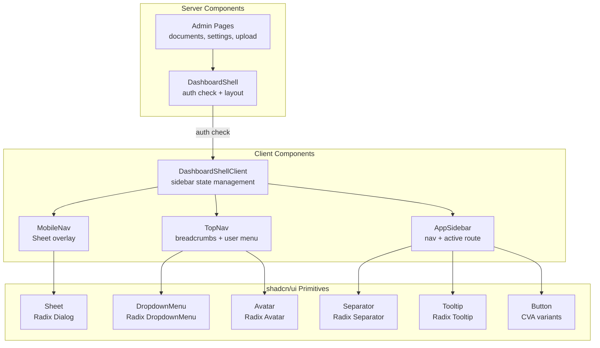

# DASHBOARD_SHELL_PLAN.md — Implementation Plan

> Detailed plan for implementing the Dashboard Shell layout system for Mimotes. This is the foundational SaaS layout that all authenticated pages will use.

---

## Overview

### What We're Building

A professional dashboard layout shell that replaces the current duplicated inline headers in all admin pages. Inspired by Vercel, Linear, and ChatGPT Team.

### Current State

Three admin pages each have their own inline header with navigation links — identical pattern duplicated 3 times:

- [`app/(admin)/documents/page.tsx`](app/(admin)/documents/page.tsx:6) — Header with Chat, Settings, Upload links
- [`app/(admin)/settings/page.tsx`](app/(admin)/settings/page.tsx:6) — Header with Documents, Chat links
- [`app/(admin)/documents/upload/page.tsx`](app/(admin)/documents/upload/page.tsx:6) — Header with back link

Each page independently calls `auth()` and `redirect("/login")` — this will be centralized in the shell.

### Target State

```
┌─────────────────────────────────────────────────────────────┐
│ ┌──────────┐ ┌──────────────────────────────────────────────┐│
│ │          │ │ TopNav: Breadcrumbs + User Menu              ││
│ │ Sidebar  │ ├──────────────────────────────────────────────┤│
│ │ 260px    │ │                                              ││
│ │ fixed    │ │           Content Area                       ││
│ │          │ │           (page children)                    ││
│ │          │ │                                              ││
│ └──────────┘ └──────────────────────────────────────────────┘│
└─────────────────────────────────────────────────────────────┘
```

---

## Technical Decisions

### 1. shadcn/ui + Tailwind CSS 4

The project uses Tailwind CSS 4 with `@tailwindcss/postcss`. The latest shadcn/ui CLI supports Tailwind CSS 4 natively. We will:

1. Run `npx shadcn@latest init` with appropriate flags
2. Add only the components we need: `button`, `sheet`, `dropdown-menu`, `avatar`, `separator`, `tooltip`
3. This installs the necessary `@radix-ui/*` primitives automatically

### 2. lucide-react for Icons

Replace emoji icons (🏠, 💬, 📚, etc.) with Lucide React icons for consistency and scalability. This is a dependency of shadcn/ui components anyway.

### 3. Server + Client Component Split

| Component | Type | Rationale |
|-----------|------|-----------|
| `DashboardShell` | Server | Does auth check, renders layout skeleton |
| `AppSidebar` | Client | Needs `usePathname()`, `useState` for collapse |
| `TopNav` | Client | Needs `usePathname()` for breadcrumbs, dropdown state |
| `MobileNav` | Client | Needs `useState` for open/close, overlay |

### 4. Navigation Structure (Current Scope)

Only implement navigation items that have existing pages. Future pages (Analytics, AI Playground, etc.) are NOT included.

```
Sidebar Navigation:
├── Logo + "Mimotes" (links to /)
├── ─────────────────
├── Dashboard → /dashboard (placeholder, disabled)
├── Chat → /chat
├── ─────────────────
├── KNOWLEDGE BASE (section label)
│   ├── Documents → /documents
│   └── Upload → /documents/upload
├── ─────────────────
├── Settings → /settings (bottom section)
├── ─────────────────
└── User Profile (avatar + name + email + logout)
```

### 5. Auth Centralization

`DashboardShell` becomes a server component that:
1. Calls `await auth()` 
2. Redirects to `/login` if no session
3. Passes `session` to child client components (sidebar, topnav)
4. Eliminates duplicated auth checks in each admin page

### 6. Breadcrumb Generation

Automatic breadcrumb from pathname using `usePathname()`:
- `/documents` → `Dashboard > Documents`
- `/documents/upload` → `Dashboard > Documents > Upload`
- `/settings` → `Dashboard > Settings`

---

## Files to Create

### [`components/layout/app-sidebar.tsx`](components/layout/app-sidebar.tsx)

**Type**: Client Component (`"use client"`)

**Props**:
```typescript
interface AppSidebarProps {
  user: {
    name?: string | null;
    email?: string | null;
    image?: string | null;
  };
}
```

**Responsibilities**:
- Render sidebar navigation with sections
- Highlight active route using `usePathname()`
- Collapsible section groups (Knowledge Base)
- User profile at bottom with logout
- Collapse/expand toggle button
- Fixed 260px width on desktop, hidden on mobile

**Key UI Elements**:
- Logo: `Bot` icon from lucide-react + "Mimotes" text
- Nav items: `Link` from next/link with icon + label
- Active state: `bg-blue-50 text-blue-600` (from blueprint design system)
- Hover state: `bg-gray-100`
- Section labels: uppercase, 11px, `text-gray-500`, letter-spacing
- Collapse chevron: `ChevronDown` / `ChevronRight` from lucide-react
- User avatar: shadcn `Avatar` component with initials fallback
- Logout: Server action `logout()` from `lib/actions.ts`

**Icons to Use** (lucide-react):
- `Bot` — Logo
- `LayoutDashboard` — Dashboard
- `MessageSquare` — Chat
- `BookOpen` — Knowledge Base section
- `FileText` — Documents
- `Upload` — Upload
- `Settings` — Settings
- `ChevronDown` / `ChevronRight` — Collapse toggle
- `LogOut` — Logout
- `PanelLeftClose` / `PanelLeftOpen` — Sidebar collapse

---

### [`components/layout/top-nav.tsx`](components/layout/top-nav.tsx)

**Type**: Client Component (`"use client"`)

**Props**:
```typescript
interface TopNavProps {
  user: {
    name?: string | null;
    email?: string | null;
    image?: string | null;
  };
  onMenuToggle: () => void;
}
```

**Responsibilities**:
- Render top navigation bar (fixed at top, full width)
- Display dynamic breadcrumbs from `usePathname()`
- Mobile hamburger button (visible < lg)
- User dropdown menu (avatar → profile, settings, logout)

**Key UI Elements**:
- Mobile hamburger: `Menu` icon, calls `onMenuToggle`
- Breadcrumbs: Chevron separator, last item bold
- User dropdown: shadcn `DropdownMenu` with avatar trigger
- Dropdown items: Profile, Settings, Logout

**Breadcrumb Map**:
```typescript
const breadcrumbMap: Record<string, string> = {
  "/documents": "Documents",
  "/documents/upload": "Upload",
  "/settings": "Settings",
  "/chat": "Chat",
  "/dashboard": "Dashboard",
};
```

---

### [`components/layout/mobile-nav.tsx`](components/layout/mobile-nav.tsx)

**Type**: Client Component (`"use client"`)

**Props**:
```typescript
interface MobileNavProps {
  open: boolean;
  onClose: () => void;
  user: {
    name?: string | null;
    email?: string | null;
    image?: string | null;
  };
}
```

**Responsibilities**:
- Render sidebar as overlay from left (like ChatGPT mobile)
- Backdrop overlay that closes on click
- Same navigation items as AppSidebar
- Close on navigation (auto-close after link click)
- Trap focus when open (accessibility)

**Implementation**: Uses shadcn `Sheet` component (Radix Dialog under the hood) with `side="left"`.

**Key UI Elements**:
- Sheet width: 280px
- Backdrop: semi-transparent black overlay
- Same nav items as AppSidebar
- Close button: `X` icon in top-right corner
- Smooth slide-in animation

---

### [`components/layout/dashboard-shell.tsx`](components/layout/dashboard-shell.tsx)

**Type**: Server Component (no `"use client"`)

**Props**:
```typescript
interface DashboardShellProps {
  children: React.ReactNode;
  /** Optional: override the default page title for breadcrumbs */
  title?: string;
}
```

**Responsibilities**:
- Auth guard: `await auth()` → redirect if not authenticated
- Render the overall layout structure
- Pass session user data to client components
- Manage mobile sidebar open/close state (via wrapper client component)

**Layout Structure**:
```tsx
// Server component that does auth check
export default async function DashboardShell({ children, title }: DashboardShellProps) {
  const session = await auth();
  if (!session?.user) redirect("/login");

  return (
    <DashboardShellClient user={session.user} title={title}>
      {children}
    </DashboardShellClient>
  );
}

// Client wrapper that manages sidebar state
"use client"
function DashboardShellClient({ user, children, title }) {
  const [sidebarOpen, setSidebarOpen] = useState(false);
  
  return (
    <div className="min-h-screen bg-gray-50">
      {/* Desktop sidebar */}
      <aside className="hidden lg:fixed lg:inset-y-0 lg:flex lg:w-[260px] ...">
        <AppSidebar user={user} />
      </aside>
      
      {/* Mobile sidebar */}
      <MobileNav open={sidebarOpen} onClose={() => setSidebarOpen(false)} user={user} />
      
      {/* Main content area */}
      <div className="lg:pl-[260px]">
        <TopNav user={user} onMenuToggle={() => setSidebarOpen(true)} />
        <main className="p-6 lg:p-8">
          {children}
        </main>
      </div>
    </div>
  );
}
```

**Design Tokens** (from SAAS_UI_BLUEPRINT.md):
- Sidebar width: `260px` (desktop), `280px` (mobile sheet)
- Sidebar background: `bg-white` with `border-r border-gray-200`
- Top nav height: `h-16` (64px)
- Content area: `bg-gray-50` page background
- Page padding: `p-6` mobile, `p-8` desktop
- Content max-width: `max-w-7xl` (or fluid depending on page)

---

## Files to Modify

### [`app/(admin)/documents/page.tsx`](app/(admin)/documents/page.tsx)

**Before**: 58 lines with inline header, auth check, navigation links
**After**: ~10 lines wrapping content in `DashboardShell`

```tsx
import DashboardShell from "@/components/layout/dashboard-shell";
import DocumentList from "@/components/documents/document-list";

export default function DocumentsPage() {
  return (
    <DashboardShell title="Documents">
      <DocumentList />
    </DashboardShell>
  );
}
```

**Removed**: `auth()`, `redirect()`, `Link` imports, entire header JSX
**Max-width change**: Content area max-width handled by DashboardShell or page-level wrapper

### [`app/(admin)/settings/page.tsx`](app/(admin)/settings/page.tsx)

**Before**: 52 lines with inline header
**After**: ~10 lines

```tsx
import DashboardShell from "@/components/layout/dashboard-shell";
import AISettingsForm from "@/components/settings/ai-settings-form";

export default function SettingsPage() {
  return (
    <DashboardShell title="Settings">
      <div className="max-w-3xl">
        <AISettingsForm />
      </div>
    </DashboardShell>
  );
}
```

### [`app/(admin)/documents/upload/page.tsx`](app/(admin)/documents/upload/page.tsx)

**Before**: 41 lines with inline header
**After**: ~10 lines

```tsx
import DashboardShell from "@/components/layout/dashboard-shell";
import UploadForm from "@/components/documents/upload-form";

export default function UploadPage() {
  return (
    <DashboardShell title="Upload Document">
      <div className="max-w-2xl">
        <UploadForm />
      </div>
    </DashboardShell>
  );
}
```

---

## Dependencies to Install

| Package | Purpose | Type |
|---------|---------|------|
| `lucide-react` | Icon library | Direct dependency |
| `@radix-ui/react-dropdown-menu` | User menu dropdown | Via shadcn/ui |
| `@radix-ui/react-tooltip` | Sidebar tooltip on collapse | Via shadcn/ui |
| `@radix-ui/react-dialog` | Mobile sheet (overlay sidebar) | Via shadcn/ui |
| `@radix-ui/react-separator` | Visual dividers | Via shadcn/ui |
| `@radix-ui/react-avatar` | User avatar with fallback | Via shadcn/ui |
| `class-variance-authority` | shadcn/ui component variants | Via shadcn/ui |

**Note**: `clsx` and `tailwind-merge` are already installed. The `cn()` utility already exists in [`lib/utils.ts`](lib/utils.ts:4).

---

## CSS Changes

### [`app/globals.css`](app/globals.css)

Add shadcn/ui CSS variables to the existing `@theme inline` block:

```css
@theme inline {
  --color-background: var(--background);
  --color-foreground: var(--foreground);
  --font-sans: var(--font-geist-sans);
  --font-mono: var(--font-geist-mono);
  
  /* shadcn/ui color variables */
  --color-sidebar-background: #f9fafb;
  --color-sidebar-foreground: #374151;
  --color-sidebar-primary: #2563eb;
  --color-sidebar-primary-foreground: #ffffff;
  --color-sidebar-accent: #eff6ff;
  --color-sidebar-accent-foreground: #1d4ed8;
  --color-sidebar-border: #e5e7eb;
  --color-sidebar-ring: #2563eb;
}
```

---

## Architecture Diagram



---

## Responsive Behavior

| Breakpoint | Sidebar | Top Nav | Content Padding |
|------------|---------|---------|-----------------|
| < 768px (mobile) | Hidden, Sheet overlay | Hamburger + Logo + Avatar | `p-4` |
| 768px-1023px (tablet) | Hidden, Sheet overlay | Breadcrumbs + Avatar | `p-6` |
| ≥ 1024px (desktop) | Fixed 260px | Breadcrumbs + Avatar | `p-8` |

---

## What We're NOT Building (Deferred)

- Dashboard widgets page (`/dashboard`)
- Analytics pages
- AI Playground
- Prompt management
- Workspace/multi-tenancy
- API keys
- Collapsible sidebar (icon-only mode) — future enhancement
- Dark mode — future enhancement
- Notification bell — future enhancement
- Workspace switcher dropdown — future enhancement

---

## Risks & Mitigations

| Risk | Impact | Mitigation |
|------|--------|------------|
| shadcn/ui init fails with Tailwind CSS 4 | High | Manual setup of CSS variables if CLI fails |
| Radix UI peer dependency conflicts | Medium | Pin versions, test build after install |
| Chat page (`/chat`) has different layout needs | Low | Chat page stays outside DashboardShell (public, h-screen) |
| Breaking existing admin page functionality | Medium | Only refactor layout wrapper, not content components |
| Build size increase from Radix UI | Low | Tree-shaking eliminates unused exports |

---

## Verification Checklist

- [ ] `npm run build` passes with 0 errors
- [ ] `/documents` page loads with sidebar + topnav
- [ ] `/documents/upload` page loads with sidebar + topnav
- [ ] `/settings` page loads with sidebar + topnav
- [ ] `/chat` page unaffected (no sidebar)
- [ ] `/` homepage unaffected
- [ ] `/login` and `/register` unaffected
- [ ] Active nav item highlighted correctly
- [ ] Breadcrumbs show correct path
- [ ] Mobile: hamburger opens sidebar overlay
- [ ] Mobile: sidebar closes on navigation
- [ ] User menu dropdown works (profile, settings, logout)
- [ ] Unauthenticated users redirected to `/login`
